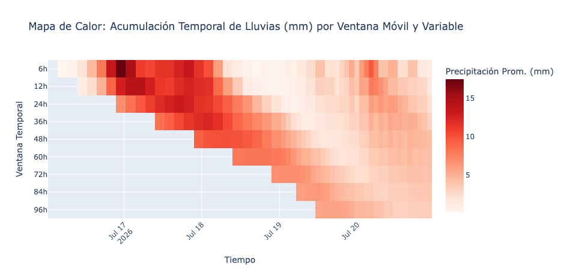

# Resumen Ejecutivo

Este portal presenta la infraestructura analítica desarrollada para la evaluación de eventos de precipitación extrema y saturación hídrica en la zona centro-norte de Chile. El sistema traduce telemetría meteorológica compleja en matrices de acumulación multi-ventana y métricas operativas directas para respaldar la toma de decisiones en tiempo real.

{fig-align="center" width="90%"}

---

# Contexto Climatológico e Histórico: Julio 2026

En julio de 2026, la zona centro-norte de Chile enfrentó un evento hidrometeorológico crítico originado por un **río atmosférico de Categoría 5** acoplado a un tren de sistemas frontales, intensificado por la fase cálida de El Niño.

::: {.callout-important}
## Estado de Catástrofe Nacional
El evento causó emergencias mayores entre las regiones de Coquimbo y Ñuble, registrando **15 personas fallecidas, 16 desaparecidas** y más de 16.000 damnificados por colapsos viales y desbordes de cauces principales (río Elqui, estero Marga Marga y estero Quilpué).
:::

### Registros Históricos Destacados

* **La Serena (La Florida):** 200.2 mm (máximo histórico desde 1954).
* **Combarbalá:** 285.5 mm (récord absoluto).
* **Valparaíso:** 173.6 mm en 48 horas (327.3 mm acumulado mensual).
* **Chillán:** 312.2 mm acumulados continuos.